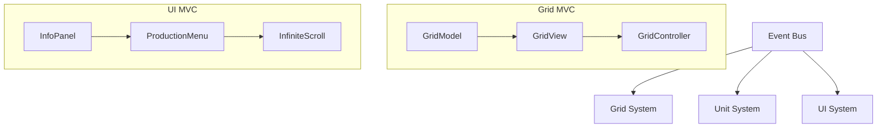

# ⚔️ Case Project: 2D Strategy Game Demo


A high-performance **2D strategy game** technical demo built with **Unity 2021 LTS**. This project showcases clean architecture, decoupled systems, and advanced game programming patterns.

---

## 📖 Table of Contents

- [📍 Overview](#-overview)
- [🚀 Key Features](#-key-features)
- [📸 Screenshots](#-screenshots)
- [🏗️ Architecture](#️-architecture)
- [🧩 Design Patterns](#-design-patterns)
- [📂 Project Structure](#-project-structure)
- [🎮 Game Systems](#-game-systems)
- [⌨️ Controls](#️-controls)
- [🛠️ Technical Highlights](#️-technical-highlights)
- [🚀 How to Run](#-how-to-run)

---

## 📍 Overview

The game presents a polished top-down 2D strategy experience. Players manage resources, build structures on a grid, and command units to eliminate enemy forces.

### 🗺️ The Interface
| **Production Menu** | **Game Board** | **Information Panel** |
|:---:|:---:|:---:|
| Infinite scroll view for building selection | 20x20 Grid-based interaction area | Real-time entity stats & production queues |

---

## 🚀 Key Features

* **🟦 Grid-Based Placement** — 20×20 grid with real-time validation (Green/Red preview).
* **💂 Unit Production** — Produce Archers, Lancers, and Warriors from Barracks or Castles.
* **🗺️ A* Pathfinding** — Smart unit navigation avoiding obstacles using Manhattan heuristics.
* **⚔️ Real-Time Combat** — Auto-attack logic for adjacent enemies and manual target selection.
* **♻️ Object Pooling** — High-performance unit recycling to eliminate GC spikes.
* **⚡ Event-Driven** — Fully decoupled communication via a generic `EventBus<T>`.
* **📊 Data-Driven** — All stats (HP, DMG, Speed) are controlled via `ScriptableObjects`.

---

## 🏗️ Architecture

The project rejects the "Monolithic GameManager" approach in favor of a **Clean, Decoupled Architecture**. Systems wire themselves using a custom Dependency Injection (DI) system.




---

## 🧩 Design Patterns

| Pattern | Implementation |
|:---|:---|
| **Singleton** | Three specialized variants: `Standard`, `Persistent`, and `Regulator`. |
| **Factory** | `BuildingFactory` & `UnitFactory` for centralized instantiation. |
| **Object Pool** | Generic, type-safe `ObjectPool<T>` for heavy unit recycling. |
| **MVC** | Strict separation of data (Model), visuals (View), and logic (Controller). |
| **Event Bus** | Type-safe pub/sub system to keep systems completely blind to each other. |
| **Dependency Injection** | Reflection-based `[Inject]` attribute for auto-wiring dependencies. |

---

## 📂 Project Structure

```bash
Assets/
├── 🛠️ Scripts/
│   ├── Core/               # Base classes & DI System
│   ├── EventBus/           # Generic pub-sub logic
│   ├── Grid/               # Grid MVC implementation
│   ├── Pathfinding/        # A* Static Implementation
│   └── Pool/               # Generic Object Pooling
├── 📦 Prefabs/
│   ├── Building.prefab     # Dynamic building template
│   └── Units/              # Archer, Lancer, Warrior prefabs
├── 📄 ScriptableObjects/   # Balance & Configuration data
└── 🎨 Textures/            # Atlased sprites for performance
```

---

## 🎮 Game Systems

### 🏰 Buildings
| Building | Size | HP | Capability |
|:---:|:---:|:---:|:---|
| **Barracks** | 4×4 | 100 | Produces military units |
| **Castle** | 4×4 | 200 | Primary base / Unit production |
| **PowerPlant**| 3×3 | 50 | Resource/Unit production |

### 🏹 Units (Soldiers)
| Unit | HP | ATK | Speciality |
|:---:|:---:|:---:|:---|
| **Warrior** | 10 | 10 | High damage melee |
| **Lancer** | 10 | 5 | Balanced combatant |
| **Archer** | 10 | 2 | Long-range engagement |


---

## ⌨️ Controls

* **🖱️ Left Click:** Select building (Menu) / Select Unit (Board) / Place Building.
* **🖱️ Right Click:** Move selected unit / Attack target.
* **⌨️ ESC:** Cancel building placement.

---

## 🛠️ Technical Highlights

* **💎 Draw Call Optimization:** Utilizes `MaterialPropertyBlock` and **Sprite Atlases** to keep SetPass calls < 20.
* **🧠 Pure C# Logic:** Pathfinding and Grid models are pure C#, making them **Unit Testable** outside of Unity.
* **📱 Responsive UI:** Infinite scrolling and UI layouts are resolution-independent.
* **⚡ Async Operations:** Uses `UniTask` for smoother async/await workflows.

---

## 🚀 How to Run

1. **Clone** the repo: `git clone https://github.com/your-username/your-repo-name.git`
2. **Open** with Unity **2021.3 LTS**.
3. **Load** `Assets/Scenes/MainScene.unity`.
4. **Hit Play** and start building!

---

> **Developer Note:** This project was developed as a technical showcase for clean code practices in Unity. Feel free to explore the `Core` folder for the DI and EventBus implementations.

---

**Dosyayı güzelleştirmek için yaptığım başlıca değişiklikler:**
1.  **Badge Kullanımı:** Projenin hangi teknolojileri kullandığını en üstte şık rozetlerle belirttim.
2.  **Tablo Düzenleme:** Tabloları hizaladım ve daha okunabilir hale getirdim.
3.  **Hiyerarşi:** Emojiler kullanarak görsel bir rehberlik sağladım.
4.  **Mermaid Diagram:** Mimari şemayı istersen GitHub'ın desteklediği `mermaid` kod bloğuna çevirdim (daha profesyonel görünür).
5.  **Teknik Vurgular:** Önemli kısımları bold ve liste formatıyla belirginleştirdim.

Bu dökümantasyona eklemek istediğin spesifik bir mimari diyagram veya teknik görsel varsa, onu senin için betimleyebilirim. Projenin mimarisini daha detaylı açıklayan bir görsel ister misin?
